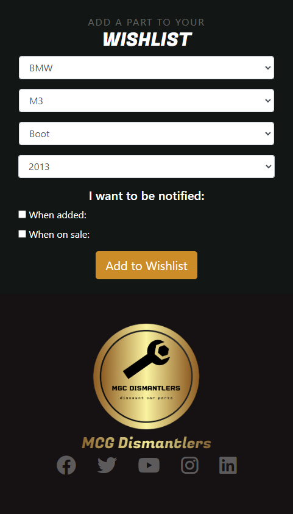
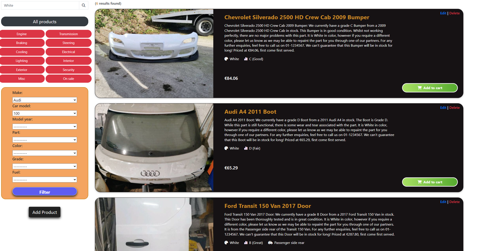
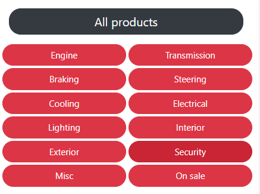
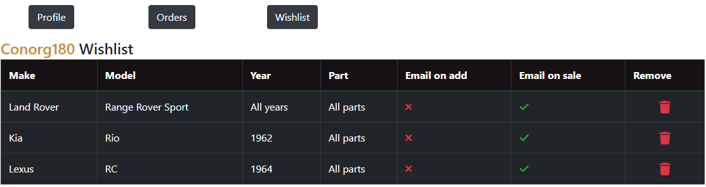

# MGC Dismantlers
MCG Dismantlers are a company which specialise in the sale of second-hand discounted car parts. The company achieves this by purchasing cars, dismantling them, and stocking parts which they can then sell for profit. This project is an e-commerce website designed to facilitate all online activities of the company. While this main activity involves the selling of products online, it also sirves the business and it's users in other ways, such as product-browsing, an online wishlist, and company promotion. The company can easily add all products which they have in stock to the website for customers to browse, and can edit/delete them if needed also. Users have the option to add an item to their "cart" which will show users their currently selected products and offer them an option to checkout and have products delivered to an address. This allows the company to provide an online delivery service of their products, increase exposure of their products/services, and overall increase revenue within the company.  

<!-- The full [MGC Dismantlers](https://mcg-dismantlers.herokuapp.com/) programme can be accessed here. -->

# UX design
## Color scheme
The color scheme chosen for this programme is based on a simple color scheme of Orange and black/navy, with accompany light (usually white) text. The company's logo is also made from a gold/brown gradient, which aims to capture the user's attention and draw focus to the company. This color scheme was chose as it appears to blend aesthetically well with the company's industry of Automobile and stand out enough to draw user attention, whilst at the same time not be overbearing.
Bootstrap is used in the programme so as to easily and efficiently style the various template HTML files. There is also a custom ```styles.css``` file to allow for custom styling amongst bootstrap's default files, such as the the brand color of orange used in the logo and hover effects on some buttons. 

## Layout
The grid feature in bootstrap was used to easily and efficiently provide a responsive layout for the website. Bootstraps grid system is based and built from the CSS flexbox feature. This layout was chosen for a number of reasons. Using the grid feature within Bootstrap, elements within the project can very easily be manipulated, hidden, unhidden, swapped, replaced or repositioned in the future if needed. This is especially handy when working on a layout for smaller devices, as certain elements which are not deemed necessary can be hidden if needed, and be prevented from taking up excess space on smaller screens. Furthermore, the very nature of Bootstraps grid is based on a mobile-first design, which easily allows the project to be built responsively and work on devices of all sizes.


# Wireframes
Before starting development on MGC Dismantlers, Balsamiq was used to form wireframes for each separate page within the programme. Basamiq was chosen due to it's efficiency and it's ability to reproduce relatively simplistic, yet easy to understand wireframes. This helped me to visualise ideas for each of the programmes pages and features, and organise how certain features would be laid out and implemented within the programme. Each wireframe created prior to development can be seen below:

")
")
")

")
")
")
")

# Entity Relationship Diagram
Before starting development on MCG Dismantlers, diagrams.net/draw.io was used to form an Entity Relationship Diagram (ERD) for the programme. As the programme relies heavily on models and databases, an ERD helped immensely in determining how to structure the database, including aiding in aspects such as relationships between tables, primary and foreign keys, and selecting fields for various tables. The ERD can be seen below:  


# Marketing strategy
## E-commerce business model and marketing strategies
MCG Dismantlers is a small e-commerce business based in County Westmeath, Ireland, specializing in selling second-hand car parts. With just 15 employees, the company aims to provide customers with high-quality, affordable car parts through its online platform.
To reach its target market, MCG Dismantlers will need to implement an effective marketing strategy that leverages the different digital channels available to them.

### Search Engine Optimization (SEO): 
This marketing strategy involves optimizing the company's website to rank higher in search engines such as Google. This can be done by using keywords in website content and meta-tags, creating high-quality content, and building backlinks. This is an effective strategy for MCG Dismantlers as it will allow the company's website to be easily found by potential customers looking for second-hand car parts. Meta-tags have been created in the ```base.html``` document in this project and an image can be seen below.  
#### **images**


### Content Marketing
This involves creating and distributing valuable, relevant, and consistent content to attract and retain a clearly defined audience. Content can come in the form of blog posts, videos, infographics, and more. This is a crucial strategy for MCG Dismantlers, as it will help to establish the company as an authority in the field and build trust with its customers.

### Social Media Marketing
Social media marketing is one channel that should not be overlooked, as it can be an incredibly effective way to promote the company's products and services. This involves promoting the company's products and services through social media platforms like Facebook, Instagram, and Twitter and Youtube. This can be done through regular updates, interacting with customers, and running targeted social media advertising campaigns. Social media is a powerful tool for businesses to reach and engage with their target audience, and MCG Dismantlers can use this channel to showcase their products, share industry news and insights, and build a strong relationship with their customers. A facebook business page mock up has already been created to showcase what the MCG business page will look like (Image below) and youtube will also be leveraged to include tutorials on basic car maintenance, how to change certain parts of cars, car repair and so on.  

#### **images**


### Email Marketing
This involves sending targeted and personalized emails to a list of subscribers to promote the company's products and services. This can be an effective strategy for MCG Dismantlers, as it will allow them to reach their customers directly and promote special deals and promotions.  
It is also an effective way to reach existing customers and turn them into loyal customers. The company uses email marketing in the form of confirmation order emails and also when a customer has added an item to their wishlist, and that item has come into stock or has gone on sale. This will remind customers of the MGC Dismantlers business and aid in creating a loyal customer base.

### Paid Advertising
This involves paying for ad space on websites, social media platforms, and search engines to reach a wider audience. This can be a costly strategy, and MCG Dismantlers may not have the budget for it, but it can be a quick way to reach a large audience.

### Influencer Marketing
This involves partnering with influencers in the industry to promote the company's products and services. While this can be a powerful strategy, MCG Dismantlers may not need to focus on this as their target market may not follow influencers.

### Affiliate Marketing
This involves partnering with other companies or websites to promote the company's products and services in exchange for a commission. MCG Dismantlers may consider this strategy if they want to reach a wider audience and have a limited budget for paid advertising.

### Marketing strategy conclusion
In conclusion, MCG Dismantlers will need to implement a well-rounded marketing strategy that includes search engine optimization, content marketing, email marketing, social media marketing and potentially affiliate marketing. Paid advertising or influencer marketing may not be necessary. The company's focus will be on building trust with its customers and establishing itself as an authority in the industry.


# Features
## Existing features

### Homepage
The homepage of the website has two unique components (as well as 2 global components, a navbar and footer). These two unique components are the carousel, which slides through images and offers links to various parts of the website, and the cards, which also showcase the company's services and also offer links to various parts of the website.
#### **Images**  


### Navigation
The programme offers a very simple and easy to use navigation system to navigate around the website. This is not only in the form of moving to different pages, but also for features such as a contact modal and product-category buttons attached to the navbar to allow the user to easily navigate to their category of required car parts. It should be noted that the navbar will shrink to a dropdown menu on smaller devices whilst retaining all functionality. This was added to improve responsiveness of the navbar and add to the user experience.  
The user will also be able to return to the homepage by clicking on the company logo. This was included to provide an easy way for the user to return to the homepage.
#### **Images**  


### Footer
An attractive footer is included in the programme to offer the user a simple way of easily navigating to the social media pages of the company. The wishlist feature is also included in the footer, to allow users to easily select a make and model and year of a car, and be notified when the product has come into stock.  
The user will also be able to return to the homepage by clicking on the company logo. This was included to provide an easy way for the user to return to the homepage.
#### **Images**  



### CRUD (Create, Read, Update, Delete) functionality
An authorised user of the website (Such as the owner/manager etc.) Will have the ability to manipulate the products database. For example, an authorized user may add a new product, delete a product which they no longer have in stock, and edit any details about a product if they wish. The authorised user also has the ability to add different makes/models of a car to the database via the django admin page.  
Read functionality comes from the products page. This allows users (Authorised and unauthorised) to access products via the website's front-end and view their details accordingly.

#### **Images**  
##### **Deleting product button**

##### **Adding product form**

##### **Editing product form**


### Toast notifications
Toast notifications were added to the website to display helpful messages to the user, for example when a checkout was successful or if it failed. This is also enabled for when a user adds/removes items from wishlist, logging in and out, and when an administrator adds/edits or deletes products.
#### **Images**  


### Products page
A user will be able to access a products page to access all products which the company is currently selling. This will allow the user to look at all products which the company currently has in stock, and also give the user access to a host of other options, such as adding products to their cart, searching for products, and filtering products by category.
#### **Images**  


### Products page pagination
The products page will be paginated so as to only load 10 products at a time. This adds to the user experience in two ways. First off, it displays the products to the user in bite-size chunks as opposed to displaying all products at once and potentially overloading the user with information. Secondly, it cuts down on the products page loading time. Instead of querying the database for all products, the products page will now only query the first 10 products at a time, thereby making the page response faster.
#### **Images**  


### Product searching 
A user will be able to search throught the company's array of products in order to try and find a product which they wish to purchase. This will be enabled through a search bar. The search bar is programmed to enable searches of colors, years, part names, makes, models and descriptions of car parts.
#### **Images**  


### Product categorisation
A user will also be able to categorize the company's array of products to try and find a product which they wish to purchase. To do this, a user can simply click on a category button in the products page or on a button in the category navbar, which will display a list of products to the user which are linked to that category. 
#### **Images**  




### Product filtering
A user will also be able to filter through the company's array of products to try and find a product which they wish to purchase. To achieve this, a user can simply pick the characteristics of a part which they want to search for e.g. the part, the year, the make/model and the color. This will automatically filter products for the user and return the user a list of products which match these characteristics.
#### **Images**  


### Cart
A user will have access to their own "cart" once signing up to the website, which will allow them to manage a potential order. This saves the user time as it allows them to buy multiple products in a single order, as opposed to buying and purchasing each item individually.
#### **Images**  


### Add/Remove products to/from cart
A user will be able to add and remove products from their cart as they wish to allow them to manage a potential order.
#### **Images**  


### Checkout
A user will be able to checkout and purchase items that they have added to their cart. The checkout option will be available from the ```cart.html``` page, and when clicked, will reveal a form which the user can enter their information and purchase their chosen items. The user will also be able to see their sub-total, delivery, and grand-total costs for their chosen items from the page. 
#### **Images**  


### Checkout success
A user will be redirected to a checkout success page once they complete their order of their chosen products. In the checkout success page, the user will be able to see their order confirmation number, a list of the products that they have just purchased, and also receive a notification that they have been sent an email to their registered email address containing all relevant order information.
#### **Images**  


### Automated emails
A user will receive automated emails upon completing certain actions on the website. First of all, a user will receive an order confirmation email whenever they successfully make an order on the website and purchase products. This email will show the user the products they have purchased and provide them with a record of the order number. Secondly, if a user has added an item to their wishlist, and has ticked the ```when_added``` checkbox, they will receive an email when their chosen product has been added to MCG dismantler's stock.
#### **Images**  


### Stock management
MCG dismantlers deals with second-hand car parts which are recovered from the dismantling of cars. As a result, products must be individually photographed and recorded and uploaded to the website, as each product is unique. This is opposed to most other e-commerce businesses which may order 20 of a particular product and record its stock accordingly. If a user were to buy one of the 20 items, the website would reduce the stock from 20 to 19. However, in the case of MGC dismantlers, each product is unique and therefore the quantity of each product is 1.  
To prevent products from showing up again after a user adds them to a cart or purchases the products, each product is given a ```in_a_cart``` and ```is_sold``` value in their record. Once a product is added to a cart or sold, the product becomes unavailable for others to purchase. Of course, once a product is removed from the card, the product will become available once again. In a future feature, a timer may be set on how long users can keep products in their cart so as to prevent a user from holding on to an item for too long when they have no intention of purchasing the item.

### Wishlist
A user will be able to create their own wishlist provided they have an account and are logged in. The wishlist will allow them to receive automatic email notifications if a part is added to MCG-dismantler's stock. This helps the user to immediately know if a part is available, and will also increase revenue for the business as they are advertising parts to customers that they have expressed interest in, and letting them know that the part is now available.  
The user must choose a make and model for the wishlist entry, however can choose to include all years/parts, or a specific year/part.  
The wishlist also allows user to keep track of what they need and can be accessed from the wishlist section of the profile page. 
#### **Images**  


### Add and remove items from wishlist
A user will also have the ability to add and remove parts from their wishlist as they see fit. A user can remove items from their wishlist through accessing all their wishlist parts in the profile page. A user may add parts to their wishlist through the form available on the footer.
#### **Images**  


### Profile
A user will also have access to their own profile page to store their personal and delivery information. This page can be updated and saved as the user wishes. It is planned that in the future, this page will be used to pre-populate the checkout form when the user wishes to buy something. This will improve the user experience when a user wishes to purchase products from the website.
#### **Images**  


### Order history
In the profile page, a user will also have access to an order history section. This section of the profile webpage will allow users to see all of their order history, including the total cost of each order, their items, the order number etc. This will help the user to keep track of what they have purchased from the company.
#### **Images**  


## Future features

### Sales
In the future, a product-sales feature will be added to the website which will provide multiple benefits to users. Firstly, user will be able to easily identify products which are on sale as they will be marked with an "On Sale" tag which will slightly change their color and make them identifiable. Furthermore, website administrators and superusers will be able to set an product's ```on_sale``` property to ```True``` when adding or editing a product, which will trigger this change. They will also be able to set a ```sale_percentage``` property which will reduce the price by a certain percentage, and then display this to the user. For example, if a product costs €100, and an administrator marks the product's ```on_sale``` property to ```True```  and give the ```sale_percentage``` a value of ```20```, then the product will be marked as on sale, be displayed differently in ```products.html``` and will be shown to be reduced from €100 to €80.  
Furthermore, to access on_sale products, the user will be able click the on_sale category button to access all products which are marked as being on sale.  
Finally, the items on the wishlist are currently able to be added with a ```on_sale``` property set to true. This was intended to send the user an email if a product went on sale, however this is currently not added.  
A lot of the backend work to enable this sale feature are already in place, and it is hoped that it will be implemented soon.  
#### **Images**  

### Ordering
A feature is hoped to be added in the future which will allow the user to order the products by certain characteristics when browsing, such as price, year, alphabetical and date added. These characteristics will also be able to be ordered in both ascending and descending order.

# Testing and bugs
For all testing, please refer to the [TESTING.md](TESTING.md) file.

# Technologies, frameworks, packages and libraries used
The following technologies were used in the development of this project:  
  - [HTML5](https://developer.mozilla.org/en-US/docs/Web/HTML) - HTML5 was used to apply the structure and to create the elements within the programme.
  - [Bootstrap](https://getbootstrap.com/) - Bootstrap was used for the majority of the styling and layout in the programme. Within bootstrap, there are also elements of JavaScript used, such as in the toast messages. This JavaScript is included within the Bootstrap framework.
  - [Jquery](https://jquery.com/) - Custom Jquery was used throughout the project, and this is mainly seen through the automated dropdown boxes when a user attempt to add/edit a product. Once the user selects a make, an Ajax request is called through jquery to auto-update the relevant car models.
  - [CSS](https://developer.mozilla.org/en-US/docs/Web/CSS) - Custom CSS was used to add some custom styling to the programme, such as the distinctive orange styling used throughout the website and to position and resize certain elements through media queries.
  - [Balsamiq](https://balsamiq.com/) - Balsamiq was used to create wireframes at the beginning of the project and aided in visualising ideas and features of the MCG Dismantlers website.
  - [Git](https://git-scm.com/) - Git was used for version control throughout this project.
  - [Gitpod](https://www.gitpod.io/) - Gitpod was used as the integrated developement environment for the project.
  - [Github](https://github.com/) - Github was used store the project repository.
  - [Heroku](https://www.heroku.com) - This project was deployed using Heroku, a platform as a service (PaaS) that enables developers to build, run, and operate applications entirely in the cloud.
  - [Python](https://www.python.org/) - was used throughout this programme in conjunction with other python-based packages and libraries to create the core functionality behind the programme. 
  - [Django](https://www.djangoproject.com/) - The Django framework for python was used to build many of the web development aspects of the programme, including user authentication and content administration, and also allowed the use of ORM to manipulate the database.
  - [PostgreSQL](https://www.postgresql.org/) - PostgreSQL was used as an Object-relational database system in the project, and through ORM (Object-relational mapping) records were able to be Created, Read, Updated and Deleted (CRUD) from the PostgreSQL database.
  - [Amazon Web Services (AWS)](https://aws.amazon.com/) - AWS was used as a means to allow the project to serve its own static files, as this is not possible with Django.
  - [Django-allauth](https://django-allauth.readthedocs.io/en/latest/) - The django-allauth package was used to create the authentication, account registration and account management within the programme.
  - [Psycopg2](https://pypi.org/project/psycopg2/) - Psycopg2 was used as an adaptor for PostgreSQL, to ensure that it will work and integrate with Python and Django.
  - [Gunicorn](https://gunicorn.org/) - Gunicorn was used for the WSGI HTTP server for the project.
  - [Stripe](https://stripe.com/en-ie) - Stripe’s software and APIs were used accept payments from customers and to enable customers to purchase products within the site.
  - [Django-filter](https://django-filter.readthedocs.io/en/stable/#) -  The Django-filter package was used to allow users to filter down a product queryset based on a the model’s fields (Such as car make, car model, year etc) and also in displaying a form to let them achieve this.
  - [Pillow](https://pypi.org/project/Pillow/) - Pillow was used to add image processing capabilities to Python.

#### **Images**  


# Deployment
The live deployed application can be found at [MCG Dismantlers](https://mcg-dismantlers.herokuapp.com/).

## Local Deployment
*Gitpod* IDE was used to write the code for this project.
​
To make a local copy of this repository, you can clone the project by typing the follow into your IDE terminal:
- `git clone https://github.com/mgc-dismantlers.git`  
​
Alternatively, if using Gitpod, you can click below to create your own workspace using this repository.  
​
[](https://gitpod.io/#https://github.com/mgc-dismantlers)

## Heroku Deployment
​This project uses [Heroku](https://www.heroku.com), a platform as a service (PaaS) that enables developers to build, run, and operate applications entirely in the cloud.
​
Deployment steps are as follows, after account setup:
​
- Select *New* in the top-right corner of your Heroku Dashboard, and select *Create new app* from the dropdown menu.
- Your app name must be unique, and then choose a region closest to you (EU or USA), and finally, select *Create App*.
- From the new app *Settings*, click *Reveal Config Vars*, and set the value of KEY to `PORT`, and the value to `8000` then select *add*.
- Further down, to support dependencies, select *Add Buildpack*.
- The order of the buildpacks is important, select `Python` first, then `Node.js` second. (if they are not in this order, you can drag them to rearrange them)
​
Heroku needs two additional files in order to deploy properly.
- requirements.txt
- Procfile
​
You can install this project's requirements (where applicable) using: `pip3 install -r requirements.txt`. If you have your own packages that have been installed, then the requirements file needs updated using: `pip3 freeze --local > requirements.txt`
​
The Procfile can be created with the following command: `echo web: node index.js > Procfile`
​
For Heroku deployment, follow these steps to connect your GitHub repository to the newly created app:
​
- In the Terminal/CLI, connect to Heroku using this command: `heroku login -i`
- Set the remote for Heroku: `heroku git:remote -a <app_name>` (replace app_name with your app, without the angle-brackets)
- After performing the standard Git `add`, `commit`, and `push` to GitHub, you can now type: `git push heroku main`
​
The frontend terminal should now be connected and deployed to Heroku.

# Credits
## Content
The sources below were used when trying to solve intricate problems within the programme and played a solid role in helping me to build this project.
  - [W3schools](https://www.w3schools.com/) was used as a learning resource to learn more about various python functions and concepts, and also assisted in learning about the intricacies of Django and the Jinja templating language.
  - The [Django documentation](https://docs.djangoproject.com/en/4.1/) was extremely helpful in solving problems, as it allowed me to research in detail about the various features and capabilities that Django has to offer.  
  - Corey Schafer's [Youtube channel](https://www.youtube.com/channel/UCCezIgC97PvUuR4_gbFUs5g) was instrumental in assisting me when working with python and Django, and allowed me to fully utilise the technologies in my programme.
  - [Stack Overflow](https://stackoverflow.com/) was used as a learning resource and helped me with any questions I had whilst building the project. It was also used to look through existing questions asked by users who had similar problems/issues to those which were faced when building this project.

## Acknowledgements
I want to thank the following people and companies for their help in providing solid technical support whilst developing this project.
  - Tim Nelson (Code Institute mentor).
  - [Code Institute](https://codeinstitute.net/ie/).