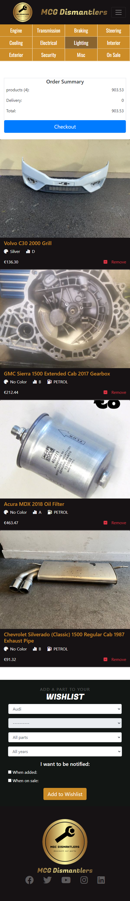
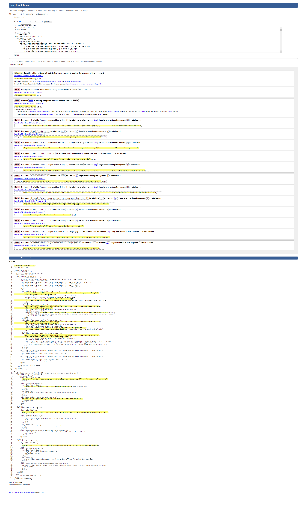

# Testing

# Browser Compatibility
Testing of the website was carried out in Firefox, Microsoft Edge, Opera and Google Chrome. Throughout the different browsers, no significant changes were observed, and the programme remained consistent both aesthetically and functionally.

# **Responsiveness**
Incorporating responsiveness into the project was made relatively straightforward due to bootstraps Grid feature. Nevertheless, testing on the programme was carried out manually to ensure responsiveness down to screen size of 350px. With Bootstrap, a burger button was also implemented in place of the navbar on smaller screens, along with the use of horizontal scrolling through tables.  

Whilst manually testing for responsiveness, some small changes had to be made to ensure that the programme was fully responsive, including:

* Change wishlist form so that each field takes up a full column on smaller screens.
* Using media queries to reduce the image size of images on carousel on smaller screens.
* Using media queries to reduce the image size of images of orders in the order history and checkout-success sections on smaller screens.
* Adding a ```min-width``` style property to the filter form on the ```products.html``` page to prevent fields in form from becoming too small.
* Removing margin and padding from carousel row and column to prevent horizontal scrolling on homepage.
* Removing price and order heading on ```cart.html``` on smaller screens.

## Homepage
#### **Images**


## Products
#### **Images**


## Profile
#### **Images**


## Order history
#### **Images**


## Wishlist
#### **Images**


## Cart
#### **Images**



## Checkout
#### **Images**


## Checkout success
#### **Images**


# Testing and identified bugs
The following tools and technologies were used to test this project:
## **W3 HTML validator**
For each HTML template in the project, W3 HTML validator was used to test if there were any syntax mistakes or bad practices used within the template. However, W3 HTML validator unfortunately does not consider Jinja templating language being used within the .html files. As a result, many errors were displayed which seemed to be a result of the validator's shortcomings. Images can be seen below of errors/issues being displayed purely because of the Jinja templating language used within the .html files.  

After reviewing these errors/issues displayed by the W3 HTML validator, it was determined that these errors/issues were clearly the result of the Jinja templating language not being taken into consideration by the test. Jinja is clearly a key component of the templates and is designed to be used with django, therefore it was decided that these errors were irrelevant.  

With that in mind, all templates were still tested and any errors which were found not to be related to Jinja were identified and corrected.  

Below are images which display some irrelevant issues displayed from the W3 HTML validator relating to Jinja, and also examples of genuine errors which were fixed.


### **base.html**
Proving hard to test the ```base.html``` page accurately with jinja tags in the template, so they were removed from the validator to test accurately.
The ```title``` element was discovered not to be present in any templates, so this was updated according to each html template.

#### **images**


### **index.html**
removed ```bold``` element as child from ```p``` element. Replaced with ```span``` element.
Furthermore, ```alt``` attributes were discovered to be left out of ```img``` elements, so were added.

#### **images**



### **products.html**
no bugs were found, however, ```alt``` attributes were discovered to be left out of ```img``` elements, so were added.

### **add-product.html**
no bugs were found.

### **edit-product.html**
no bugs found.

### **cart.html**
Added alt attributes to images
Removed ```button``` element as child from ```anchor``` elements
Furthermore, ```alt``` attributes were discovered to be left out of ```img``` elements, so were added.

#### **images**


### **checkout.html**
no bugs were found, however, ```alt``` attributes were discovered to be left out of ```img``` elements, so were added.

### **checkout-success.html**
no bugs were found, however, ```alt``` attributes were discovered to be left out of ```img``` elements, so were added.

### **profile.html**
```button``` elements were turned to ```anchor``` elements as they contained ```href``` attributes

#### **images**


### **categories-navbar.html**
no bugs found.

### **navbar.html**
no bugs found.

### **footer.html**
no bugs found.
